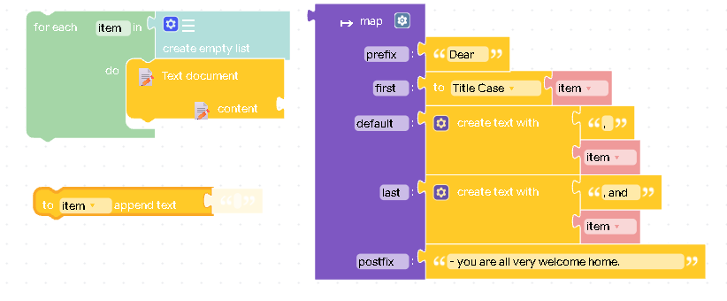
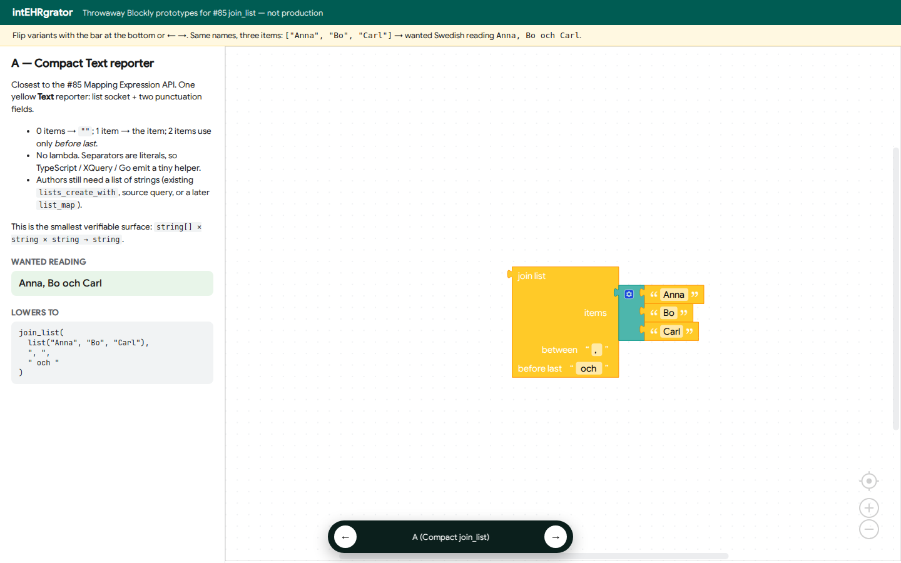
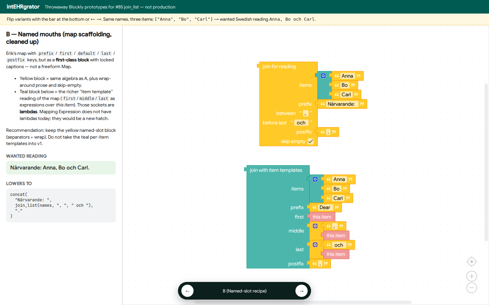
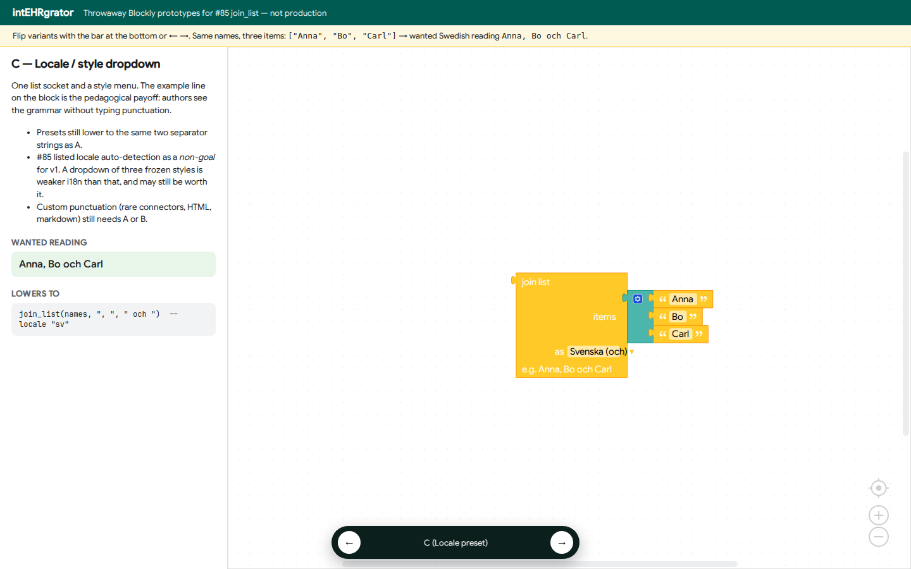
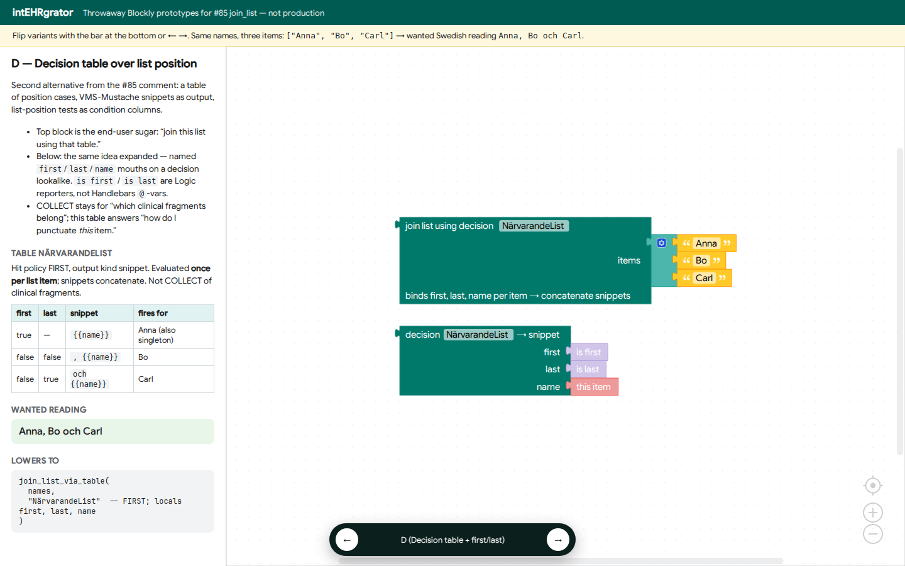

# join_list Blockly prototypes (#85)

Throwaway design capture. The live playground is `web/prototype-join-list.html`
(built to `dist/prototype-join-list.html`). Prototype block types live in
`src/blockly/blocks/join_list_prototype.ts` and are **not** on the production
toolbox.

**Question:** what should an informatician *see* when they turn
`["Anna","Bo","Carl"]` into `Anna, Bo och Carl`?

Run: `deno task prototype:join-list` then `deno task dev` and open
[http://127.0.0.1:5173/prototype-join-list.html?variant=A](http://127.0.0.1:5173/prototype-join-list.html?variant=A).
← → cycles A–D.

Inspiration (Erik’s map-as-scaffolding, 2026-09-17):

Real Blockly (modest theme). Live playground: `deno task prototype:join-list` then
`deno task dev` → http://127.0.0.1:5173/prototype-join-list.html?variant=A

### A — Compact Text reporter

### B — Named mouths (map scaffolding, cleaned up)

### C — Locale / style dropdown

### D — Decision table over list position

---

## Variants

| Key | End-user shape | Lowers to | v1? |
|-----|----------------|-----------|-----|
| **A** Compact `join_list` | Yellow Text reporter: list + *between* + *before last* | `join_list(items, sep, finalSep)` | **Yes** — smallest algebra |
| **B** Named mouths | Same algebra + prefix/postfix + skip-empty. Teal “item templates” shown only as a counter-example | `concat(prefix, join_list(...), postfix)` | Yellow part yes; teal lambdas **no** |
| **C** Locale preset | List + `Svenska (och)` / English / Oxford dropdown | Same two strings as A | Maybe later; #85 listed locale auto-detect as a non-goal |
| **D** Decision table over position | `join list using decision NärvarandeList`; sheet rows on `first`/`last` | Per-item FIRST table, concatenate snippet cells | Allowed *alongside* A, not instead of it |

**A** is the production candidate. **B** (yellow) is A with wrap-around prose
and is worth the extra mouths if Notes often add `Närvarande: ` / `.`.
**D** is Erik’s second alternative, encoded with Blockly booleans rather than
Handlebars `@first`/`@last`.

The teal block on variant B is what the map scaffolding *wants* if
`first`/`default`/`last` are per-item expressions. Those sockets are lambdas
(`item → string`). Mapping Expression has no lambdas; `logic_list_restriction`
is the only binder today. Do not take that into v1.

---

## Would banning `@first` / `@last` enable Handlebars verification?

**No.** Disallowing those names in snippet source is not the on/off switch for
formal verification.

Facts already in the repo:

1. **Snippet cells are VMS-Mustache** ([ADR 0009](../adr/0009-verifiable-template-dialects.md)).
   Allowed: `{{name}}`, `{{#list}}`, `{{^empty}}`, comments. **No helpers, no
   `@first` / `@last`.** That ban is already in force for decision-table
   output cells. It keeps snippets interpolative so they lower to `concat` of
   literals + bound names ([formal-verification-export.md](../future/formal-verification-export.md)
   §F).

2. **VMS-Hbs already includes `@index` / `@first` / `@last` / `@key`.** They
   exist because lung-MDT uses them (`#unless @last`, `@first` in
   `test/fixtures/kintegrate/handlebars-script1.hbs`). Convert-time
   verification of the *dialect* is the whitelist (`knownHelpersOnly`) plus
   AST walk — unknown helpers, `#with`, `lookup`, lambdas, partials.

3. **`@first` / `@last` are not the opaque hole.** They are pure, bounded
   predicates: `index = 0` and `index = length − 1`. SMT can encode them the
   same way as `if`. The holes that *cannot* be encoded are lambdas,
   `lookup`, `#with`, and unregistered helpers.

4. **What they *do* cost** is authoring and codegen. Position-dependent
   punctuation inside `#each` is microplanning. It does not serialize to
   Mapping Expression today (`handlebars_to_blockly.ts` says so). XQuery/Go
   need index logic or a `join_list` helper. Gold strings still have to check
   that the author got Swedish *och* vs Oxford comma right — SMT will not.

So:

- Ban `@first`/`@last` **in snippet cells** → already done; that is what
  makes snippet verification a `concat` problem.
- Ban them **in VMS-Hbs** (`text_handlebars` / `text_code`) → lung-MDT
  becomes out-of-dialect until rewritten as `join_list` or a position table.
  That *improves the authoring surface* and mapping-contract coverage; it does
  not newly enable a proof that was otherwise impossible.
- Put `@first`/`@last` **in a decision-table logic column as Handlebars** →
  mix grains; don’t. Bind Blockly reporters `is first` / `is last` as locals
  (variant D). Snippet cells stay `{{name}}` / `, {{name}}` / ` och {{name}}`.

COLLECT vs join: COLLECT still answers “which clinical fragments belong.”
`join_list` / the position table answers “how do I punctuate this list of
strings.” They compose.

---

## Recommendation for #85 implementation

1. Ship **variant A** as `join_list` in Mapping Expression + Text toolbox.
2. Optional mutator mouths for prefix/postfix/skip-empty (yellow part of B)
   if the first Note-field example needs them; otherwise `concat` around A.
3. Keep **D** as a documented composition: `for_each`/`join` + existing
   Decision table with `first`/`last` condition columns. Needs `is first` /
   `is last` reporters (or locals filled by a `join list using decision`
   wrapper). Do not put `@first` into Mustache cells.
4. Do not implement the teal lambda recipe.
5. Do not drop `@first`/`@last` from VMS-Hbs until lung-MDT examples are
   migrated; mark those `#each` blocks as migratable to `join_list`.
