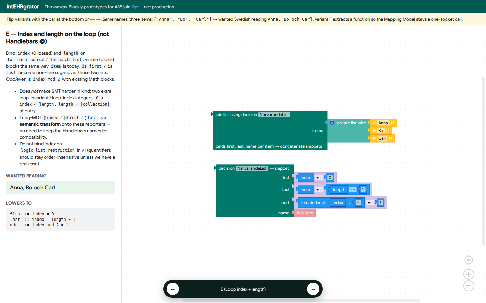
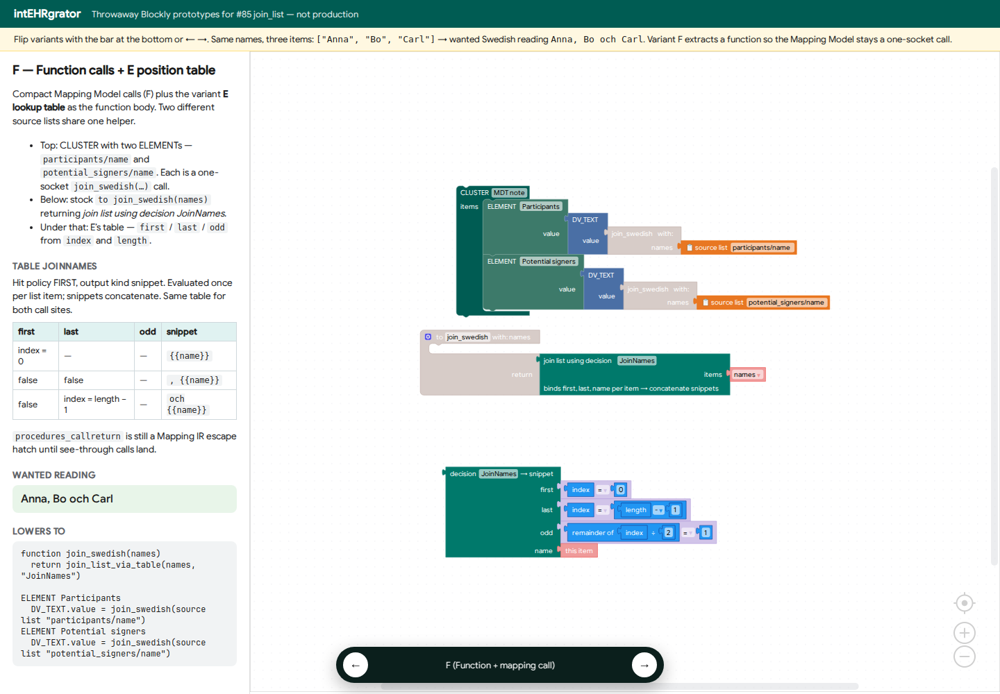

# join_list Blockly prototypes (#85)

Throwaway design capture. The live playground is `web/prototype-join-list.html`
(built to `dist/prototype-join-list.html`). Prototype block types live in
`src/blockly/blocks/join_list_prototype.ts` and are **not** on the production
toolbox.

**Question:** what should an informatician *see* when they turn
`["Anna","Bo","Carl"]` into `Anna, Bo och Carl`?

Run: `deno task prototype:join-list` then `deno task dev` and open
[http://127.0.0.1:5173/prototype-join-list.html?variant=A](http://127.0.0.1:5173/prototype-join-list.html?variant=A).
← → cycles A–F.

Inspiration (Erik’s map-as-scaffolding, 2026-09-17):


Real Blockly (modest theme). Live playground: `deno task prototype:join-list` then
`deno task dev` → http://127.0.0.1:5173/prototype-join-list.html?variant=A

### A — Compact Text reporter


### B — Named mouths (map scaffolding, cleaned up)


### C — Locale / style dropdown


### D — Decision table over list position


### E — Loop index and length



### F — Function calls + E position table



---

## Variants

| Key | End-user shape | Lowers to | v1? |
|-----|----------------|-----------|-----|
| **A** Compact `join_list` | Yellow Text reporter: list + *between* + *before last* | `join_list(items, sep, finalSep)` | **No** — not the ship path |
| **B** Named mouths | Same algebra + prefix/postfix + skip-empty. Teal “item templates” are a counter-example | `concat(prefix, join_list(...), postfix)` | Yellow part no; teal lambdas **no** |
| **C** Locale preset | List + `Svenska (och)` / English / Oxford dropdown | Same two strings as A | No |
| **D** Decision table over position | `join list using decision`; sheet rows on `first`/`last` | Per-item FIRST table, concatenate snippets | Substrate for F |
| **E** Loop `index` + `length` | Same table; `first`/`last`/`odd` derived with Math | `index = 0`, `index = length − 1`, `index mod 2` | **Yes as loop binders** |
| **F** Function + loop + table | `to join_swedish(names)`: `for each` + append JoinNames snippets + return; ELEMENT Participants / Potential signers call it | `join_swedish(source list)` at each slot | **Yes — main suggestion** |

**Do not ship A.** The yellow compact `join_list` reporter is a discuss-only
shape. The authoring path is **F**.

D (powered by E’s binders) is the per-item table F evaluates inside the loop.
Lung-MDT `#each` + `@first`/`@last` is a **semantic transform** onto these
binders — do not keep the Handlebars names for compatibility.

**Compact main code (variant F):** a 1-arg helper `join_swedish(names)` whose
body is:

```text
result := ""
for each item in names
  append JoinNames(item) to result
return result
```

`JoinNames` is E’s position table (`first`/`last`/`odd` from `index` and
`length`). Mapping Model slots stay one-socket calls:

`ELEMENT Participants → join_swedish(source list "participants/name")`
and
`ELEMENT Potential signers → join_swedish(source list "potential_signers/name")`.

Same table for both lists. `procedures_callreturn` is still a Mapping IR
escape hatch until see-through calls
([function-test-harnesses.md](../future/function-test-harnesses.md)).

The teal block on variant B is what the map scaffolding *wants* if
`first`/`default`/`last` are per-item expressions. Those sockets are lambdas
(`item → string`). Mapping Expression has no lambdas; `logic_list_restriction`
is the only binder today. Do not take that into v1.

---

## Loop `index` and `length` — does that make verification harder?

**No, not in kind.** It adds two integers per iteration, both derived and
bounded.

| Binder | Meaning | SMT |
|--------|---------|-----|
| `item` (already) | Current element | Same as today |
| `index` | `0 … length−1` | `0 ≤ index < length` |
| `length` | `\|collection\|` at loop entry | Constant for the loop (VMS has no list mutators) |

`is first` ⇔ `index = 0`. `is last` ⇔ `index = length − 1`. Odd/even ⇔
`index mod 2` (already a VMS Math block). Handlebars `@index` / `@first` /
`@last` rewrite onto that table; `@key` stays map iteration only.

**Where to bind:** emission loops — `for_each_source` and `for_each_list` —
with child reporters that pick the enclosing binder (same dropdown pattern as
`logic_current_item`). Nested loops need distinct names (`name` / `name_index`,
or a nearest-enclosing picker).

**Where not to bind in v1:** `logic_list_restriction`. Quantifiers should stay
order-insensitive (`all of list match P(item)`). Index there makes “the first
specimen must be labelled” easy and also makes accidental positional bugs easy.

**Verification caveats (not holes):**

1. Grain still means “add one source node → add one target child.” Do not use
   `index` to mint `:n` slot ids.
2. `length` must be the collection as of loop entry, not a live mutating size.
3. Nested loops: two index/length pairs, not a global `@index`.

Slightly more SMT state per iteration; same fragment as a bounded `for`.

---

## Would banning `@first` / `@last` enable Handlebars verification?

**No**, and we do not need those names for lung-MDT compatibility. Snippet
cells already cannot use them (VMS-Mustache, [ADR 0009](../adr/0009-verifiable-template-dialects.md)).
They are index predicates, not the opaque hole (`lookup`, `#with`, lambdas,
unknown helpers). Once `#each` is rewritten to `join_list` and/or a position
table, VMS-Hbs can drop `@first`/`@last` (and `@index` if the loop binders
cover it).

COLLECT vs join: COLLECT still answers “which clinical fragments belong.”
`join_list` / the position table answers “how do I punctuate this list of
strings.” They compose.

---

## Recommendation for #85 implementation

**Main suggestion: variant F** — a 1-arg Blockly Function that **loops** the
incoming list, appends each JoinNames snippet, and returns the concatenated
string. Mapping Model slots stay one-socket calls
(`join_swedish(source list "participants/name")` /
`join_swedish(source list "potential_signers/name")`). The table is defined
once and reused; it can grow (period on last, zebra, first-N) without
touching every ELEMENT.

Do **not** ship variant A (compact `join_list` reporter).

Then:

1. Ship **D** as the per-item Decision table + VMS-Mustache snippets (F’s
   loop evaluates this once per item).
2. Bind **index** and **length** on `for_each_*` (variant E). Derive
   `is first` / `is last` from them. That is the substrate D/F need, and the
   semantic image of lung-MDT `@index` / `@first` / `@last`.
3. Optional yellow-B mouths (prefix/postfix/skip-empty); no teal lambdas.
4. Do not keep VMS-Hbs `@first`/`@last` for compatibility. Transform, then
   drop.

