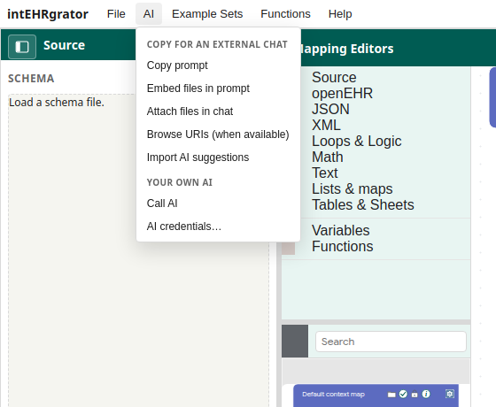

# AI in the web app

The **AI** menu has two sections for the web app, and a third that appears only in the downloaded desktop app. This page is the first two. The desktop section is [Desktop and a local IDE](desktop-and-local-ai.md).

Back to the [tutorial index](../TUTORIAL.md).

*Copy-and-paste actions are grouped above Call AI and credentials.*

## Copy for an external chat

Use this when you paste a prompt into ChatGPT, Claude, Cursor, or another chat you already pay for.

The three packing actions copy a prompt and remember the choice:

- **Embed files in prompt** — schema, template, and examples are inside the markdown.
- **Attach files in chat** — the prompt tells you which files to attach yourself.
- **Browse URIs (when available)** — the prompt points at URLs instead of embedding bytes.

**Copy prompt** repeats the last packing mode you chose.

Paste the model’s reply with **Import AI suggestions**. The dialog accepts raw JSON or an `intehrgrator-suggestions` fence. Validation errors stay in the dialog so you can copy them back to the chat. The format is [AI_SUGGESTION_FORMAT.md](../AI_SUGGESTION_FORMAT.md).

## Your own AI

Use this when intEHRgrator should call the model itself.

1. **AI credentials…** — pick a provider, endpoint, API key, and model. Credentials stay in this browser. They are never stored in the Project Bundle.
2. **Call AI** — sends the current prompt. The default mode uses mapping tools with the same names as MCP (`map_slot`, `import_suggestions`, `run_test`, …) and applies them on the open canvas. **Suggestions JSON only** is the older one-shot import.

On GitHub Pages the browser often cannot reach a cloud API (CORS). The desktop app forwards Call AI through its own server, so Gemini, OpenAI, Anthropic, Hugging Face, and OpenCode Zen work there. Key pages: [Call AI credentials](../AI_CREDENTIALS.md).

| Provider | Create credentials |
|----------|-------------------|
| Google Gemini | [AI Studio API keys](https://aistudio.google.com/app/apikey) · [OpenAI-compat docs](https://ai.google.dev/gemini-api/docs/openai) |
| OpenAI | [API keys](https://platform.openai.com/api-keys) · [Chat completions](https://platform.openai.com/docs/api-reference/chat) |
| Anthropic Claude | [Console keys](https://console.anthropic.com/settings/keys) · [OpenAI SDK compat](https://platform.claude.com/docs/en/api/openai-sdk) |
| Ollama local | [OpenAI compatibility](https://docs.ollama.com/openai) (dummy key `ollama`) |
| Ollama Cloud | [API keys](https://ollama.com/settings/keys) · [Cloud](https://docs.ollama.com/cloud) |
| LM Studio local | [OpenAI compat](https://lmstudio.ai/docs/developer/openai-compat) · [Auth tokens](https://lmstudio.ai/docs/developer/core/authentication) |
| LM Studio cloud / remote | [LM Link](https://lmstudio.ai/docs/lmlink/basics) · [Bionic models](https://lmstudio.ai/docs/bionic/models) |
| Hugging Face | [Access tokens](https://huggingface.co/settings/tokens) · [Inference Providers](https://huggingface.co/docs/inference-providers/en/index) |
| OpenCode Zen | [Auth / API key](https://opencode.ai/auth) · [Zen](https://opencode.ai/docs/zen/) |

Refreshing a target or source opens a report with **Copy merge prompt** and **Call AI**. Blocks you detached stay on the canvas.

**Run Test** after any AI pass. See [Tests and export](tests-and-export.md).
