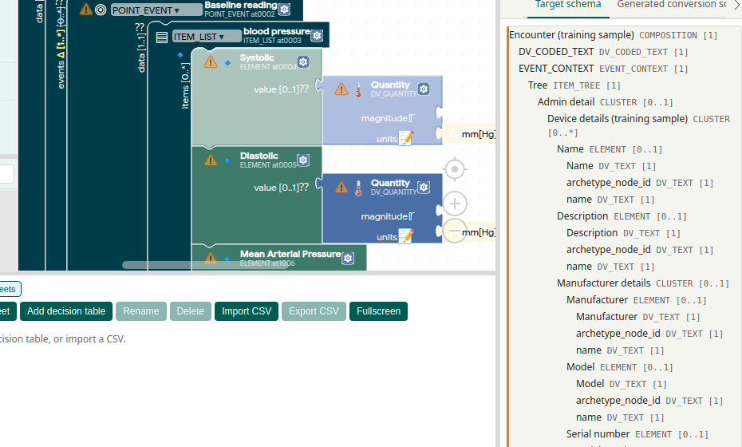

# Basic mapping

Map one source field onto one target slot. Nothing on this page repeats, and nothing is filled in by an AI. When you want those, continue with [Loops](loops.md) or [AI in the web app](ai-in-the-web-app.md).

Back to the [tutorial index](../TUTORIAL.md).

## Open the workbench

- **Web:** [regionstockholm.github.io/intehrgrator/](https://regionstockholm.github.io/intehrgrator/)
- **Desktop:** download a build from [GitHub Releases](https://github.com/regionstockholm/intehrgrator/releases) and run the binary for your platform.
- **Stable web version:** [versions.json](https://regionstockholm.github.io/intehrgrator/versions.json) lists pinned URLs (`/v0.7/`, and so on). The site root is the bleeding-edge build.

Three panes: **Source** (left, slide-away), **Mapping Editor** (centre), **Target & Previews** (right, tabbed and slide-away).

Loading an Example Set is the fastest way to see a finished map. The steps below start from your own files. Click **ⓘ** beside a pane header when a format is unclear.

## Load source data

### Source schema (upper left)

Click **Load Schema**. That accepts a JSON Schema, an XML/XSD sample, or an openEHR Web Template. The ▾ menu also has **From GitHub template…**.

The schema tree shows field names and types, so you can author a mapping before you have an example file.

### Example instances (lower left)

Click **+ Add Example** and pick one or more JSON or XML instance files (or a GitHub folder). Each file gets its own tab.

- The **active tab** drives click-to-map and the matching **Test Run** on the right.
- Switch tabs to compare patients or edge cases.

## Load a target

In **Target & Previews**, click **Load target & default context map**. Pick a target (file, URL, or one already loaded). You can attach a **default context map** now, or skip that and read [Default context](default-context.md) later.

Confirm scaffolds the **Template Skeleton**. **New** loads the target into the **Target schema** tab only, so you can pull chips onto the canvas and then Apply.

Supported targets:

- openEHR operational template / Web Template (`.opt`, `.wt.json`, `.adl`)
- JSON Schema
- XML Schema (XSD)
- Free-form text (no schema; Handlebars, decision-table snippets, and other text blocks)

An openEHR template becomes a **Template Skeleton**: nested Blockly blocks for the clinical model, including silent-mandatory RM fields the template file does not mention.

## Map one field (click-to-map)

Use this when the source value and the target slot are both single values, not lists.

1. Click a **value slot** on a Blockly block (or a row in the Mapping Specification tab).
2. The slot enters **listening mode** (highlighted).
3. Click a node in the **schema tree** or the **active example tree**.
4. A source-query block with an XPath expression is inserted.

You can also drag a source node onto a slot. Yellow **constraint warning** triangles mark mandatory fields that are still empty.

*Click a magnitude slot (Systolic), then a node in the source tree. The slot stays in listening mode until that click.*

## Try an Example Set

1. In the toolbar, open **Example Sets** and pick a row.
2. Confirm if the canvas already has work. Loading a set **replaces** the current source, target, and mapping.
3. Wait for the progress overlay. The status bar then names the set.
4. Look at the left pane and the Mapping Editor.

- **Unmapped** rows leave Template Skeleton mouths empty (yellow triangles on mandatory slots).
- **Mapped** rows restore saved Blockly, and often Sheets and a default context map.
- Switch instance tabs, then **Run Test** in **Conversion Test Run(s)**. How Test Run works is in [Tests and export](tests-and-export.md).

Catalog ids (`dummy-json-vitals`, `Simple-vitals`, …) stay stable for agents. The menu shows the **title**.

### Unmapped vs mapped

Each **family** (same source and target) has at least two rows.

| Kind | What loads | Use it to |
|------|------------|-----------|
| **Unmapped** | Schema, instances, target only | Practise click-to-map on a blank skeleton |
| **Mapped** | The same files plus a saved mapping | Inspect a known-good canvas and run Test Run |
| **Mapped, decision tables** | Lung-MDT and chemo only | The same instances, with Notes and TermIds as decision tables. See [Sheets and decision tables](sheets-and-decision-tables.md) |

Titles put the family and route first and the mapping state last ([#166](https://github.com/regionstockholm/intehrgrator/issues/166)):

`{family} ({route}) — unmapped` · `{family} ({route}) — mapped` · `{family} ({route}) — mapped, decision tables`

| Family (route) | Unmapped | Mapped | Mapped, decision tables |
|----------------|----------|--------|-------------------------|
| Dummy vitals (JSON Schema → JSON Schema) | … — unmapped | … — mapped | — |
| Dummy vitals (JSON Schema → openEHR Template) | … — unmapped | … — mapped | — |
| Dummy vitals series (JSON Schema with repeating measurements → openEHR) | … — unmapped | … — mapped | — |
| OBX MHV1 (JSON → openEHR) | … — unmapped | … — mapped | — |
| Patient-reported chemotherapy symptoms (FLAT → TakeCare XML) | … — unmapped | … — mapped | … — mapped, decision tables |
| Lung MDT form (→ TakeCare XML) | … — unmapped | … — mapped | … — mapped, decision tables |
| Medication order data from Cytodos and TC via Karda (JSON → openEHR FLAT) | … — unmapped | … — mapped | — |
| Medication treatment data from Cytodos and TC via Karda (JSON → openEHR FLAT) | … — unmapped | … — mapped | — |

### Suggested first loads

1. **Dummy vitals (JSON Schema → JSON Schema) — unmapped** — click-to-map systolic, diastolic, and unit. Run Test on Mapping preview or TypeScript.
2. **Dummy vitals (JSON Schema → JSON Schema) — mapped** — three instances. Test Run should show `120` / `80` / `mm[Hg]` on `instance-1`.
3. A clinical **mapped** set: Dummy vitals → openEHR, chemo with Output mode **Go Template**, or lung-MDT with **Mapping preview** or **Handlebars**.

Named-invalid vitals instances (the filename contains `invalid` or `broken`) are negative tests. They should not produce a fully valid template instance.

Simple-vitals and series **valid** instances can still show ⚠ for remaining template messages (required attributes, unit list, CLUSTER vs ELEMENT, default-context `CODE_PHRASE`). The clinical magnitudes `120` / `80` / `72` (series `138`) are present.

Lung-MDT **Mapping preview** and **Handlebars** agree on evaluated TermId and Note pairs. Karda mapped sets emit Simplified FLAT. Remaining Karda validation messages are recorded in [karda-admin-mapping-benchmark.md](../design/karda-admin-mapping-benchmark.md).

Lung-MDT Handlebars `@first` / `@last` is still open ([#135](https://github.com/regionstockholm/intehrgrator/issues/135)).

## Save your work

Mappings stay **on your computer**. The web app uses the browser’s storage. The desktop app uses the same kind of local storage. They are not uploaded, and they do not appear as ordinary files in your file explorer.

**Autosave** runs after a short pause (about 10 seconds). The status bar shows the time, for example “autosaved at 14:32”. Autosave and named saves survive closing the app and restarting the computer. Clearing site data removes them. Use **Export Project** for a file you can keep or move.

| Action | What it does |
|--------|--------------|
| **Autosave** | Snapshot after edits. Reopen with **Load Project** → Last autosave |
| **Save as** | Named snapshot in local storage |
| **Load Project** | Reopen a saved snapshot |
| **Export Project** | Download a `.intehrgrator` bundle |
| **Import Project** | Load a `.intehrgrator` file |

These commands are in the toolbar **File** menu. **Functions** has its own lecture.

## Help

- **ⓘ** next to pane headers explains formats.
- **Help** in the toolbar opens this tutorial series, **Report a bug**, and **Request a feature**. Describe the clinical workflow you are trying to support.
- **Language** in the toolbar switches Blockly UI messages (`en`, `sv`, `de`, `es`, `ca`, `fr`). The model language in the target pane is separate.

## Next

- [Default context](default-context.md) when the target needs language, facility, or other values that are not in the source file.
- [Optional RM fields](optional-rm.md) when the skeleton is missing a structure the Reference Model allows.
- [Tests and export](tests-and-export.md) when you want to see the produced instance.
