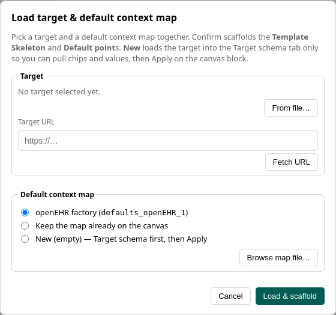

# Default context

Many targets need values that are not in the source file. They are either fixed (a language code, a facility id) or supplied later by the system that runs the conversion. The **default context map** holds those values. It also scaffolds the same lookup into every matching slot, so you change the map once instead of every block.

Back to the [tutorial index](../TUTORIAL.md). Assumes [Basic mapping](basic-mapping.md).

## Load a map with the target

A blank project has **no** factory rows. Click **Load target & default context map** and, for openEHR, pick the openEHR factory.

Each **entry** has:

- a **runtime key** (`language`, `facility`, …) read at convert time with `maps_get("defaults", …)`
- **scaffold targets** (chips such as `*.language`) that light **Default point**s when you confirm or click **Apply**

**New** loads the target into the **Target schema** tab only. Pull PARTY or terminology pieces onto value sockets and chip paths, **Save as**, then Apply.

The ▾ menu **Refresh from file/URL** updates a target or source without wiping canvas mappings.

When you confirm a joint load, scaffolding fills **Default point**s with map lookups. Editing a value shows up in Test Run immediately. New chips wait until you Apply.

*The joint load dialog is where you pick both the target and a default context map.*

## Where the map lives

The unique default context map sits on the canvas. It is not in the **Lists & maps** toolbox drawer. Generic maps and terminology lookups in that drawer are a different thing; see [Sheets and decision tables](sheets-and-decision-tables.md).

Generated conversion scripts accept a **defaults** map at convert time — the same structure you authored here. See [Tests and export](tests-and-export.md).
