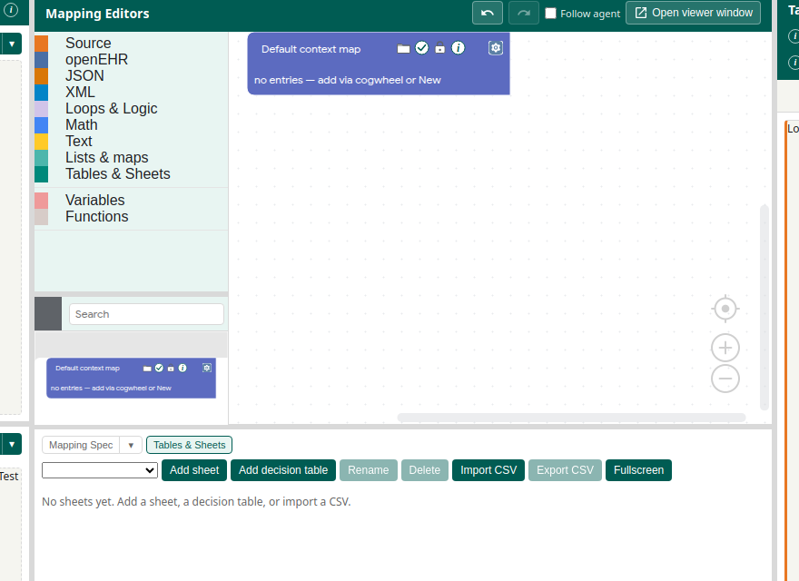

# Sheets and decision tables

Two grid tools live in the Mapping Editor. A **Sheet** is a lookup table (a code in, a code out). A **decision table** is a rule matrix (several conditions in, one or more results out, including a text snippet).

Back to the [tutorial index](../TUTORIAL.md).

## Toolbox

| Drawer | Use for |
|--------|---------|
| **Lists & maps** | Generic maps, terminology lookups (`get map key …`), list operations. The unique **default context map** is on the canvas, not in this drawer. See [Default context](default-context.md). |
| **Sheets** | 2D grids pasted from Excel or CSV. Read them with `sheet_get_*` and `sheet_lookup`. |
| **Logic** | Conditions, list restrictions, set operations |

## Sheets tab

The **Sheets** tab in the Mapping Editor embeds a spreadsheet for grids owned by the project. Paste a terminology table there, name it, and look up a cell from a Blockly block. A sheet is reference data: every row is a fact, not a rule.

*Tables & Sheets is where the grids live. Blockly blocks only read them.*

## Decision tables

Use a decision table when several independent inputs together pick an output: a TermId and a narrative note, a hit policy of “first matching row”, a don’t-care cell. The Example Set rows marked **mapped, decision tables** (lung-MDT and chemo) are the worked examples. They keep the same instances and target as the mapped sibling, and they author Notes and TermIds as tables instead of nested `if` / `eq` blocks.

Generated scripts receive a **sheets** bag at convert time, covering both kinds of grid. See [Tests and export](tests-and-export.md).
